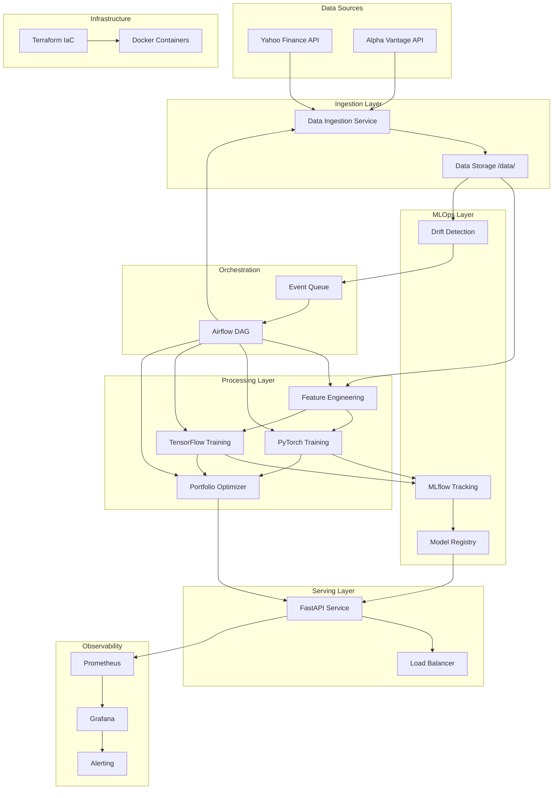

# Design Document

## Overview

QuantFolio implements a cloud-native ML pipeline architecture using microservices, event-driven patterns, and infrastructure-as-code principles. The system is designed for horizontal scalability, fault tolerance, and multi-cloud deployment while supporting local development that accurately simulates cloud environments.

The architecture follows a layered approach:
- **Data Layer**: Cloud-native data ingestion and storage simulation
- **Feature Engineering Layer**: Scalable feature computation with caching
- **ML Training Layer**: Multi-framework model training with experiment tracking
- **Optimization Layer**: Portfolio optimization using predicted returns
- **Serving Layer**: Cloud-native API with auto-scaling capabilities
- **Orchestration Layer**: Event-driven pipeline coordination
- **Observability Layer**: Comprehensive monitoring and alerting

## Architecture

### High-Level Architecture



### Cloud-Native Design Patterns

The system implements several cloud-native patterns:

1. **Microservices Architecture**: Each component is independently deployable and scalable
2. **Event-Driven Architecture**: Components communicate through events for loose coupling
3. **Circuit Breaker Pattern**: Fault tolerance for external API calls
4. **Bulkhead Pattern**: Resource isolation between different workloads
5. **Retry with Exponential Backoff**: Resilient handling of transient failures
6. **Blue-Green Deployment**: Zero-downtime model updates
7. **Auto-scaling**: Horizontal scaling based on workload demands

## Components and Interfaces

### Data Ingestion Service

**Purpose**: Fetch and validate financial data from external APIs

**Cloud-Native Features**:
- Containerized service with horizontal auto-scaling
- Circuit breaker for API resilience
- Event publishing for downstream processing
- Cloud object storage simulation with partitioning

**Interface**:
```python
class DataIngestionService:
    async def fetch_daily_data(self, symbols: List[str]) -> DataBatch
    async def validate_data_quality(self, data: DataBatch) -> ValidationResult
    async def store_data(self, data: DataBatch) -> StorageResult
    async def publish_data_event(self, event: DataAvailableEvent) -> None
```

**Configuration**:
- API rate limiting and retry policies
- Data validation rules and thresholds
- Storage partitioning strategy (date/symbol)
- Event publishing configuration

### Feature Engineering Service

**Purpose**: Transform raw financial data into ML-ready features

**Cloud-Native Features**:
- Stateless processing for horizontal scaling
- Caching layer for computed features
- Batch and streaming processing capabilities
- Resource-aware computation scheduling

**Interface**:
```python
class FeatureEngineeringService:
    async def compute_technical_indicators(self, data: PriceData) -> TechnicalFeatures
    async def create_time_windows(self, features: TechnicalFeatures, window_size: int) -> TimeSeriesFeatures
    async def validate_features(self, features: TimeSeriesFeatures) -> ValidationResult
    async def cache_features(self, features: TimeSeriesFeatures) -> CacheResult
```

**Features Computed**:
- Returns (simple, log, adjusted)
- Moving averages (SMA, EMA, various periods)
- Momentum indicators (RSI, MACD, Stochastic)
- Volatility measures (realized volatility, GARCH)
- Time-based features (day of week, month effects)

### ML Training Services

**Purpose**: Train and evaluate multiple ML models for return prediction

#### PyTorch Training Service

**Cloud-Native Features**:
- Distributed training support (DDP)
- GPU/CPU resource optimization
- Model checkpointing and recovery
- Hyperparameter optimization integration

**Interface**:
```python
class PyTorchTrainingService:
    async def train_lstm_model(self, config: LSTMConfig, data: TrainingData) -> TrainingResult
    async def train_gru_model(self, config: GRUConfig, data: TrainingData) -> TrainingResult
    async def evaluate_model(self, model: torch.nn.Module, test_data: TestData) -> EvaluationMetrics
    async def save_model_checkpoint(self, model: torch.nn.Module, path: str) -> None
```

**Model Architectures**:
- LSTM with attention mechanism
- GRU with dropout and batch normalization
- Multi-layer perceptron baseline
- Ensemble methods for improved robustness

#### TensorFlow Training Service

**Cloud-Native Features**:
- TensorFlow Serving integration
- Model optimization for inference
- Distributed training capabilities
- Custom metrics and callbacks

**Interface**:
```python
class TensorFlowTrainingService:
    async def train_mlp_model(self, config: MLPConfig, data: TrainingData) -> TrainingResult
    async def train_cnn_model(self, config: CNNConfig, data: TrainingData) -> TrainingResult
    async def evaluate_model(self, model: tf.keras.Model, test_data: TestData) -> EvaluationMetrics
    async def export_saved_model(self, model: tf.keras.Model, path: str) -> None
```

### Portfolio Optimization Service

**Purpose**: Generate optimal portfolio allocations using ML predictions

**Cloud-Native Features**:
- Stateless optimization for scalability
- Multiple solver backends (CVXPY, MOSEK)
- Risk constraint validation
- Performance attribution analysis

**Interface**:
```python
class PortfolioOptimizationService:
    async def optimize_portfolio(self, predictions: ReturnPredictions, constraints: OptimizationConstraints) -> PortfolioWeights
    async def validate_weights(self, weights: PortfolioWeights) -> ValidationResult
    async def compute_risk_metrics(self, weights: PortfolioWeights, covariance: CovarianceMatrix) -> RiskMetrics
    async def backtest_allocation(self, weights: PortfolioWeights, historical_data: HistoricalData) -> BacktestResults
```

**Optimization Formulation**:
```
minimize: w^T Σ w (portfolio variance)
subject to:
  - E[r]^T w >= μ (expected return constraint)
  - sum(w) = 1 (budget constraint)
  - w_i >= 0 (long-only constraint, optional)
  - |w_i| <= max_weight (concentration limits)
```

### MLflow Integration Service

**Purpose**: Experiment tracking, model registry, and lifecycle management

**Cloud-Native Features**:
- Scalable artifact storage (S3/GCS simulation)
- Model versioning and lineage tracking
- A/B testing support for model deployment
- Integration with cloud ML platforms

**Interface**:
```python
class MLflowService:
    async def log_experiment(self, experiment_name: str, params: Dict, metrics: Dict) -> ExperimentRun
    async def register_model(self, model_name: str, model_uri: str, stage: str) -> ModelVersion
    async def get_latest_model(self, model_name: str, stage: str) -> ModelVersion
    async def compare_models(self, model_versions: List[ModelVersion]) -> ComparisonResult
```

### FastAPI Serving Service

**Purpose**: Provide REST API for predictions and portfolio allocations

**Cloud-Native Features**:
- Auto-scaling based on request volume
- Model caching and warm-up strategies
- Request/response validation and monitoring
- Health checks and readiness probes

**Interface**:
```python
@app.get("/predict")
async def predict_returns(symbols: List[str], horizon: int = 1) -> PredictionResponse

@app.get("/portfolio")
async def get_portfolio_allocation(risk_tolerance: float = 0.1) -> PortfolioResponse

@app.get("/health")
async def health_check() -> HealthResponse

@app.get("/metrics")
async def get_metrics() -> PrometheusMetrics
```

## Data Models

### Core Data Structures

```python
@dataclass
class PriceData:
    symbol: str
    timestamp: datetime
    open: float
    high: float
    low: float
    close: float
    volume: int
    adjusted_close: float

@dataclass
class TechnicalFeatures:
    symbol: str
    timestamp: datetime
    returns: Dict[str, float]  # simple, log, adjusted
    moving_averages: Dict[str, float]  # sma_5, sma_20, ema_12, etc.
    momentum: Dict[str, float]  # rsi, macd, stochastic
    volatility: Dict[str, float]  # realized_vol, garch_vol
    
@dataclass
class ReturnPredictions:
    symbol: str
    predictions: Dict[str, float]  # mean, std, quantiles
    confidence_intervals: Dict[str, Tuple[float, float]]
    model_metadata: ModelMetadata

@dataclass
class PortfolioWeights:
    weights: Dict[str, float]  # symbol -> weight
    expected_return: float
    expected_volatility: float
    sharpe_ratio: float
    optimization_metadata: OptimizationMetadata
```

### Database Schema (Local Simulation)

The system uses a file-based storage structure that simulates cloud object storage:

```
/data/
├── raw/
│   ├── daily/
│   │   ├── 2024/01/01/
│   │   │   ├── AAPL.parquet
│   │   │   ├── GOOGL.parquet
│   │   │   └── ...
│   └── metadata/
│       └── ingestion_logs.json
├── features/
│   ├── technical/
│   │   ├── 2024/01/01/
│   │   │   ├── AAPL_features.parquet
│   │   │   └── ...
│   └── time_series/
│       ├── windows_30d/
│       └── windows_60d/
├── models/
│   ├── pytorch/
│   │   ├── lstm_v1/
│   │   └── gru_v1/
│   ├── tensorflow/
│   │   ├── mlp_v1/
│   │   └── cnn_v1/
│   └── metadata/
│       └── model_registry.json
└── portfolios/
    ├── allocations/
    │   ├── 2024-01-01_allocation.json
    │   └── ...
    └── backtests/
        └── performance_history.parquet
```

## Error Handling

### Cloud-Native Error Handling Patterns

1. **Circuit Breaker Pattern**:
   - Implement circuit breakers for external API calls
   - Configurable failure thresholds and recovery timeouts
   - Fallback mechanisms for degraded service

2. **Retry with Exponential Backoff**:
   - Automatic retry for transient failures
   - Jittered backoff to prevent thundering herd
   - Maximum retry limits and dead letter queues

3. **Bulkhead Pattern**:
   - Resource isolation between different workloads
   - Separate thread pools for different operations
   - Resource quotas and rate limiting

4. **Graceful Degradation**:
   - Fallback to cached predictions when models fail
   - Simplified portfolio optimization when optimization fails
   - Partial results when some assets fail to process

### Error Categories and Handling

```python
class ErrorHandler:
    async def handle_data_ingestion_error(self, error: DataIngestionError) -> ErrorResponse
    async def handle_model_training_error(self, error: ModelTrainingError) -> ErrorResponse
    async def handle_optimization_error(self, error: OptimizationError) -> ErrorResponse
    async def handle_api_error(self, error: APIError) -> ErrorResponse
```

**Error Types**:
- **Transient Errors**: Network timeouts, temporary API unavailability
- **Data Quality Errors**: Missing data, outliers, validation failures
- **Model Errors**: Training failures, convergence issues, prediction errors
- **System Errors**: Resource exhaustion, configuration errors

## Testing Strategy

### Multi-Level Testing Approach

1. **Unit Tests**:
   - Individual component testing with mocks
   - Data validation and transformation logic
   - Model training and evaluation functions
   - Portfolio optimization algorithms

2. **Integration Tests**:
   - End-to-end pipeline testing
   - API endpoint testing with real models
   - Database integration testing
   - MLflow integration testing

3. **Contract Tests**:
   - API contract validation
   - Data schema validation
   - Model interface compatibility

4. **Performance Tests**:
   - Load testing for API endpoints
   - Scalability testing for training pipelines
   - Memory and CPU usage profiling
   - Latency testing for prediction endpoints

5. **Cloud-Native Testing**:
   - Container testing with Docker
   - Infrastructure testing with Terraform
   - Chaos engineering for resilience testing
   - Multi-environment deployment testing

### Test Data Strategy

```python
class TestDataManager:
    def generate_synthetic_market_data(self, symbols: List[str], days: int) -> PriceData
    def create_feature_test_cases(self) -> List[FeatureTestCase]
    def generate_model_test_scenarios(self) -> List[ModelTestScenario]
    def create_optimization_test_cases(self) -> List[OptimizationTestCase]
```

**Test Data Sources**:
- Synthetic market data with known statistical properties
- Historical data subsets for backtesting
- Edge case scenarios (market crashes, low volatility periods)
- Adversarial examples for model robustness testing

### Continuous Testing Pipeline

```yaml
# .github/workflows/test.yml
name: Continuous Testing
on: [push, pull_request]
jobs:
  unit-tests:
    runs-on: ubuntu-latest
    steps:
      - name: Run unit tests
        run: pytest tests/unit/
      
  integration-tests:
    runs-on: ubuntu-latest
    services:
      mlflow:
        image: mlflow/mlflow
    steps:
      - name: Run integration tests
        run: pytest tests/integration/
        
  performance-tests:
    runs-on: ubuntu-latest
    steps:
      - name: Run performance tests
        run: pytest tests/performance/
        
  cloud-simulation-tests:
    runs-on: ubuntu-latest
    steps:
      - name: Test cloud deployment simulation
        run: |
          docker-compose up -d
          pytest tests/cloud_simulation/
          docker-compose down
```

This design provides a comprehensive, cloud-native architecture that addresses all requirements while maintaining scalability, reliability, and observability. The system is designed to run locally while accurately simulating cloud deployment patterns and can be easily migrated to actual cloud platforms.