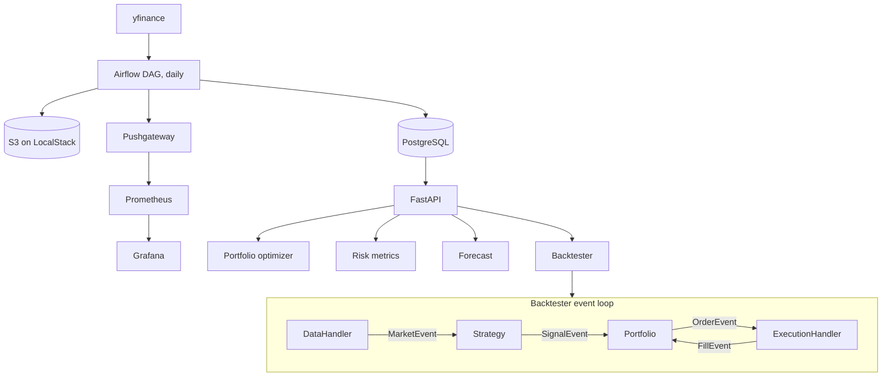

# QuantFolio

A quantitative research stack: an event-driven backtester written in both Python and C++17, a Markowitz portfolio optimizer, a walk-forward validation harness for forecasting models, and a FastAPI service over daily market data loaded by Airflow.

The numbers in this README are measured. `benchmark.py` and `cpp/benchmark.cpp` reproduce them, and [`benchmark_report.md`](benchmark_report.md) has the full tables with their caveats.

## Layout

```
backtesting/   Python event-driven engine
cpp/           C++17 port of the engine core, with its own benchmark
portfolio/     Mean-variance optimizer, risk metrics, OLS factor model
models/        LSTM, transformer, Ridge baseline, walk-forward validator
api/           FastAPI routes, Pydantic schemas, parameterized queries
data/          yfinance and Alpha Vantage fetchers, cleaning, feature engineering
airflow/       Daily ingestion DAG
monitoring/    Prometheus config and a Grafana dashboard
tests/         pytest suite and a small CSV fixture
```

## Architecture



## Backtesting engine

One queue carries four event types. On each bar the `DataHandler` pushes a single `MarketEvent`. The engine then drains the queue completely before it reads the next bar, so a signal, its order and its fill all resolve at the current bar's price. No handler can see a future bar. That constraint costs speed, and a vectorized pandas backtest would run much faster, but it removes look-ahead bias by construction.

The strategy is an SMA(10/50) crossover. It emits a signal only when the two averages change order. The portfolio sizes every order at 100 shares and records total equity on each bar. The execution handler fills at the bar's adjusted close with 0.05% slippage and a commission of $0.005 per share, $1.00 minimum.

### C++ port

`cpp/` reimplements the engine core with the same module boundaries. Events are a `std::variant` of plain structs held by value in a `std::queue`, so the run loop performs no heap allocation per event and no virtual dispatch. Tickers are integer indices, not strings. The moving averages use rolling sums, which makes each update O(1). [`cpp/README.md`](cpp/README.md) explains each choice and what it gave up.

Measured on an Apple M1 Pro, single thread, `-O3`, median of five runs over 252 bars:

| Securities | C++ bars/sec | Python bars/sec |
|---:|---:|---:|
| 7 | 26.1M | 5,300 |
| 50 | 4.6M | – |
| 200 | 0.92M | – |

Throughput falls roughly in proportion to the universe size, because the strategy and the mark-to-market both visit every ticker on every bar. Peak process memory for the C++ run stayed under 3 MB.

On a longer 7-security, 2,520-bar run the C++ engine is roughly 3,000 times faster than the Python one (2,700x to 3,500x across three runs). Much of that gap comes from the Python `DataHandler`, which walks a DataFrame with `iterrows()` and builds a dict per bar. A NumPy-backed Python loop would be far closer.

The strategy is a toy. These are throughput figures, and nothing here claims a profitable backtest.

## Portfolio optimization

`PortfolioOptimizer` solves for maximum Sharpe, minimum variance and the efficient frontier with SciPy's SLSQP, under a full-investment constraint and long-only bounds. It also reports each asset's contribution to portfolio risk.

Building the covariance matrix takes under a millisecond from 25 assets up. A max-Sharpe solve takes about 10 ms for 10 assets and 230 ms for 50. At 100 assets the solver hits its iteration cap and fails to converge. I have left that documented and unfixed.

`RiskMetrics` computes Sharpe, Sortino, maximum drawdown, historical VaR and CVaR. `FactorModel` splits portfolio variance into systematic and idiosyncratic parts with an OLS regression.

## Forecasting and validation

`WalkForwardValidator` evaluates a model on an expanding window: train on everything up to time *t*, forecast the next five steps, move forward, repeat. Training data always precedes test data.

I ran a small LSTM against ARIMA(1,0,0), a five-lag linear regression, a moving average, the historical mean and a last-value predictor. The LSTM did not win. On an AR(1) series it finished fourth of six, about 3% behind ARIMA. On white noise it finished fifth. Directional accuracy stayed near 50% for every model.

That result matches what daily returns usually look like. The comparison ran on synthetic series, because the bundled dataset has only 43 days per ticker and the validator needs 252 to begin.

## Data pipeline

The Airflow DAG runs daily with four tasks: extract, transform, load, and push metrics. Extract pulls 60 days of OHLCV for seven tickers (SPY, QQQ, AAPL, MSFT, XLF, XLK, XLE) from yfinance and uploads the raw CSV to S3 on LocalStack. Transform forward-fills gaps up to five days, drops non-positive prices, and computes log returns, 21-day annualized volatility, MACD (12/26/9) and a 14-day RSI, all grouped by ticker. Load writes to Postgres.

An Alpha Vantage fetcher exists in `data/ingestion/`. The DAG does not call it yet.

## API

| Route | What it does |
|---|---|
| `POST /api/v1/portfolio/optimize` | Max-Sharpe or min-variance weights |
| `POST /api/v1/portfolio/risk` | Risk metrics for a weighted portfolio |
| `POST /api/v1/portfolio/factor` | Factor loadings and R² |
| `POST /api/v1/forecast` | Five-step forecast from a Ridge AR(5) model or the LSTM |
| `POST /api/v1/backtest` | Runs the event loop and returns value, trades, Sharpe, drawdown |
| `GET /api/v1/data/...` | Symbols, OHLCV and features |

Queries use bound parameters. Request schemas reject malformed ticker symbols before any SQL runs.

Called in-process against SQLite, median latency is about 7 ms for an optimize request and 9 ms for a backtest. Those figures exclude the network and Postgres.

## Running it

Tests and benchmarks need no Docker:

```bash
python -m venv .venv && source .venv/bin/activate
pip install -r requirements-bench.txt
pytest tests/ -q
python benchmark.py
```

The C++ engine:

```bash
cd cpp
cmake -B build && cmake --build build
./build/benchmark
```

The full stack:

```bash
cp .env.example .env
docker-compose up -d
# API docs  http://localhost:8000/docs
# Airflow   http://localhost:8080
# Grafana   http://localhost:3000
```

## Limitations

- The bundled data is 7 tickers and 43 days. Anything that needs more history runs on synthetic series.
- Most Python benchmark figures are single runs on one laptop.
- The optimizer does not converge at 100 assets and uses an unshrunk sample covariance.
- The forecasting models are not wired into the backtest strategy.
- Fills are instant and complete. There is no order book, partial fill or latency model.
- I have not load-tested the API or timed the Docker stack.

[`KNOWN_ISSUES.md`](KNOWN_ISSUES.md) lists the bugs found while benchmarking and how each was fixed.
