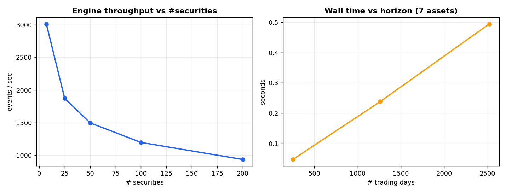
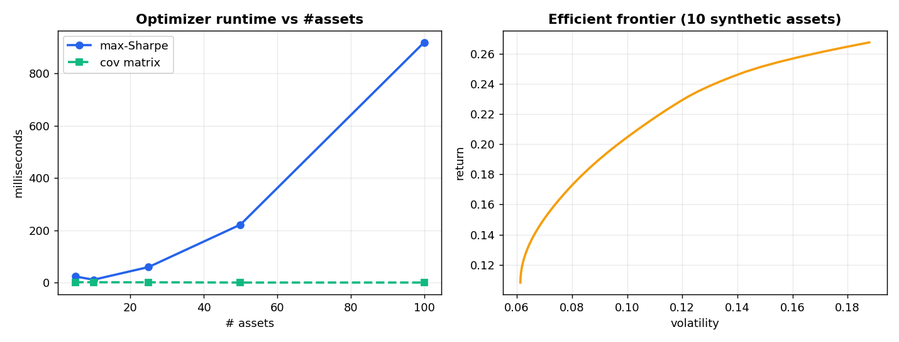
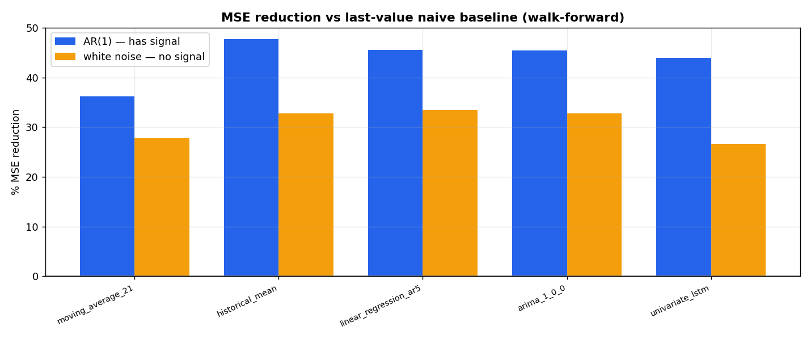
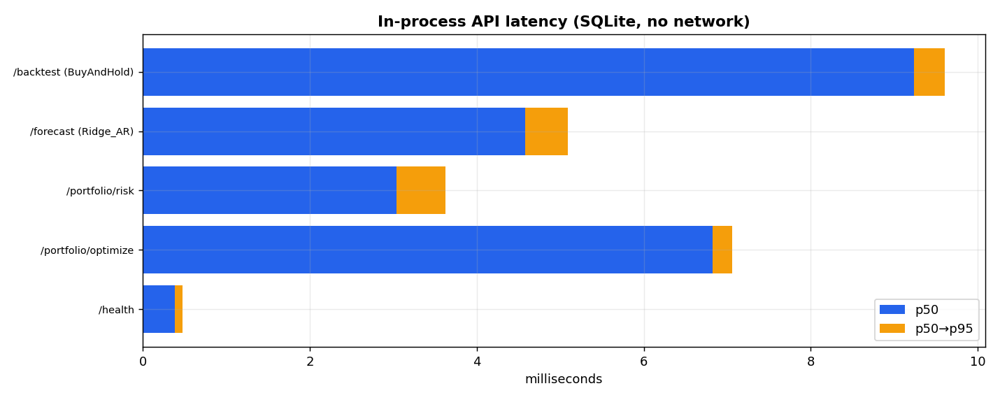

# Benchmarks

Every figure here comes from `benchmark.py` (Python) or `cpp/benchmark.cpp` (C++). Raw Python output is in `benchmark_results.json`.

**Machine:** Apple M1 Pro, 8 cores, 16 GB, macOS. Python 3.9, clang 15. Single process.

**Reproduce:**

```bash
pip install -r requirements-bench.txt
python benchmark.py                       # writes benchmark_results.json and charts/
cd cpp && cmake -B build && cmake --build build && ./build/benchmark
```

Read the numbers with two caveats. Most Python figures are single runs, not averages. The bundled market data is small: 7 tickers and 43 daily bars. Anything that needs more history runs on seeded synthetic series and says so.

## 1. Backtesting engine

Both engines run the same loop: one market event per bar, then drain the queue before advancing. The strategy is an SMA(10/50) crossover that emits a signal only when the fast and slow averages change order.

### Python

Synthetic prices, 252 bars, `tracemalloc` enabled for the memory column.

| Securities | Bars/sec | Events/sec | Peak traced memory |
|---:|---:|---:|---:|
| 7 | 1,978 | 3,014 | 0.45 MB |
| 25 | 653 | 1,873 | 1.12 MB |
| 50 | 310 | 1,496 | 2.22 MB |
| 100 | 138 | 1,197 | 4.37 MB |
| 200 | 57 | 936 | 8.68 MB |

Without tracing, 7 securities run at 5,100 to 5,300 bars/sec, and wall time grows linearly from 252 to 2,520 bars (0.05 s to 0.49 s). The memory column counts Python allocations made during the run. It is not process RSS.



### C++

Five runs per row, median reported. Details and the min–max spread are in [`cpp/README.md`](cpp/README.md).

| Securities | Bars/sec | Events/sec |
|---:|---:|---:|
| 7 | 26.1M | 39.4M |
| 25 | 9.0M | 26.5M |
| 50 | 4.6M | 22.4M |
| 100 | 1.9M | 16.6M |
| 200 | 0.92M | 15.0M |

Peak process RSS stayed under 3 MB (`getrusage`).

In both languages the cost per bar is O(securities). Bars per second is the more useful number, because events per second depends on how often the strategy trades. An earlier version of the Python strategy drew random signals on every bar and reported around 80,000 events/sec. That number reflected signal volume, not engine speed, and it went away when the strategy was fixed.

## 2. Portfolio optimizer

`scipy.optimize.minimize` with SLSQP. The objective is negative Sharpe, the weights sum to one, and each weight is bounded to [0, 1]. Inputs are 600 days of synthetic returns.

| Assets | Covariance | Max-Sharpe solve | Converged | Iterations |
|---:|---:|---:|:--:|---:|
| 5 | 1.7 ms | 5.6 ms | yes | 8 |
| 10 | 1.1 ms | 10.3 ms | yes | 11 |
| 25 | 0.4 ms | 61 ms | yes | 31 |
| 50 | 0.4 ms | 230 ms | yes | 61 |
| 100 | 0.5 ms | 982 ms | **no** | 100 |

At 100 assets SLSQP hits its default cap of 100 iterations and returns `success=False`. `maximize_sharpe` logs a warning and still returns the weights, which is a known issue. I did not test sizes between 50 and 100. The small-asset timings are noisy between runs; the 5-asset solve has measured anywhere from 6 to 24 ms.

A 50-point efficient frontier over 10 assets takes about 285 ms, and all 50 points converge.

On the real 7 tickers the optimizer raises the Sharpe ratio from 3.4 (equal weight) to 5.1. This is in-sample over 42 observations. The optimizer is scored on the same mean and covariance it was given, so the improvement is mechanical. It shows the solver works and says nothing about future returns.



## 3. Risk metrics

Sharpe, Sortino, maximum drawdown, historical VaR and CVaR. A combined Sharpe, drawdown and VaR call on 2,520 daily returns takes about 224 microseconds, averaged over 1,000 calls.

## 4. Forecasting

`WalkForwardValidator` runs an expanding window: at least 252 training points, a 63-step stride and a 5-step forecast horizon. Each model sees the same folds.

The bundled data has 43 observations per ticker, far fewer than the 252 needed to start. So this comparison uses two synthetic series of 1,400 points. One is AR(1) with coefficient 0.35. The other is Gaussian white noise.

**AR(1)**

| Model | MSE | Directional accuracy |
|---|---:|---:|
| Historical mean | 1.49e-4 | 0.57 |
| Linear regression, 5 lags | 1.55e-4 | 0.53 |
| ARIMA(1,0,0) | 1.56e-4 | 0.55 |
| LSTM | 1.60e-4 | 0.53 |
| Moving average, 21 | 1.82e-4 | 0.44 |
| Last value | 2.85e-4 | 0.49 |

**White noise**

| Model | MSE | Directional accuracy |
|---|---:|---:|
| Linear regression, 5 lags | 9.68e-5 | 0.50 |
| Historical mean | 9.79e-5 | 0.55 |
| ARIMA(1,0,0) | 9.79e-5 | 0.55 |
| Moving average, 21 | 1.05e-4 | 0.44 |
| LSTM | 1.07e-4 | 0.58 |
| Last value | 1.46e-4 | 0.52 |

The LSTM does not beat ARIMA on either series. It trails by about 3% on AR(1) and 9% on noise. The simplest models do best. Directional accuracy sits near 0.5 throughout and R² is negative for every model, which is what near-unpredictable returns should produce.

Last value is a weak baseline for returns. It repeats the previous noisy observation, so anything that predicts close to the mean beats it by a wide margin. The comparison that matters is between the LSTM, ARIMA and the linear model.

An earlier README claimed a 12% MSE improvement over ARIMA. No experiment in this repository produced that figure, and it has been removed.



## 5. ETL transform

`DataCleaner` followed by `FeatureEngineer` on one day's file: 301 rows, 7 tickers. The pair runs in about 20 ms. The input is too small for a rows-per-second figure to mean much. The extract and load stages need the network and Postgres, so they are not measured here.

## 6. API

FastAPI routes called through Starlette's `TestClient` against a SQLite copy of the fixture data. Fifty calls per endpoint, 200 for `/health`.

| Endpoint | p50 | p95 | p99 |
|---|---:|---:|---:|
| `GET /health` | 0.38 ms | 0.48 ms | 0.76 ms |
| `POST /portfolio/optimize`, 5 assets | 6.83 ms | 7.06 ms | 7.29 ms |
| `POST /portfolio/risk`, 3 assets | 3.04 ms | 3.62 ms | 3.66 ms |
| `POST /forecast`, Ridge AR(5), 3 tickers | 4.58 ms | 5.09 ms | 5.16 ms |
| `POST /backtest`, buy and hold, 3 tickers | 9.23 ms | 9.61 ms | 9.75 ms |

These calls run in-process. They leave out network round trips, Postgres and container overhead, so they are lower bounds.



## Not measured

- Out-of-sample returns for any strategy
- Latency under concurrent load, and throughput in requests per second
- Docker start-up time, container CPU and memory
- End-to-end Airflow DAG runtime
